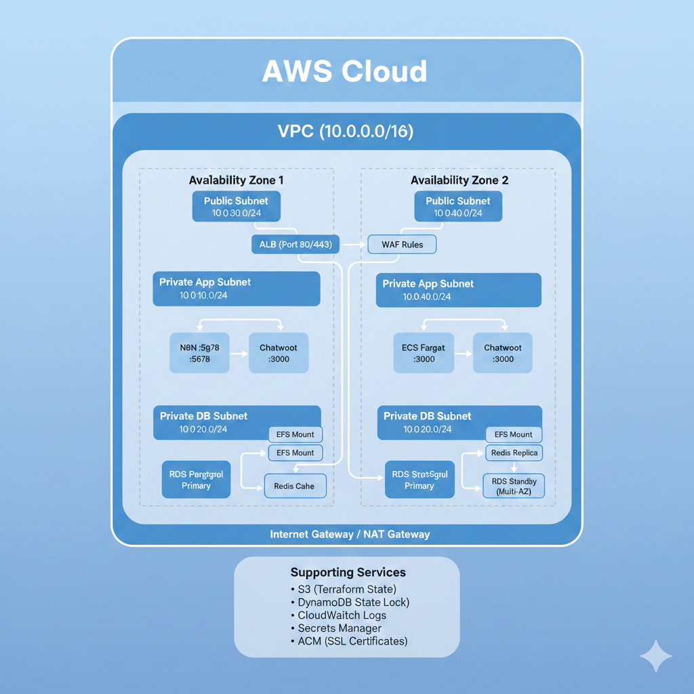

# N8N + Chatwoot Infrastructure - Terraform

This project implements the complete infrastructure to host N8N and Chatwoot applications on AWS using Terraform with modular architecture.

## What are N8N and Chatwoot?

**N8N** is an open-source workflow automation platform that allows you to connect different applications and services to automate tasks. Think of it as a tool that can automatically perform actions when certain events occur - like sending notifications, processing data, or integrating multiple systems without writing code.

**Chatwoot** is an open-source customer support platform that centralizes communication channels (website chat, email, social media) into a single interface. It enables teams to manage customer conversations efficiently with features like automated responses, team collaboration, and conversation history.

Together, these tools can create powerful automation workflows for customer service, such as automatically routing messages, creating tickets, sending notifications, and integrating with other business systems.

## Architecture

### Infrastructure Diagram



### Applications
- **N8N**: Workflow automation platform
- **Chatwoot**: Customer support system

### AWS Infrastructure
- **ECS Fargate**: Application containers
- **RDS PostgreSQL**: Shared database
- **ElastiCache Redis**: Cache and sessions
- **EFS**: Shared persistent storage
- **ALB**: Load balancer with domain-based routing
- **WAF**: Web attack protection
- **VPC**: Isolated network with public and private subnets

## Estrutura de Arquivos

```
project-n8n-chatwoot/
├── README.md                    # Main documentation
├── dev/                         # Development environment
│   ├── terraform.auto.tfvars    # Global variables (project_name, environment, aws_region)
│   ├── 0-remote-state/          # S3 Bucket and DynamoDB for remote state
│   ├── 1-vpc/                   # VPC network with subnets
│   ├── 2-rds/                   # PostgreSQL database
│   ├── 3-redis/                 # ElastiCache Redis
│   ├── 4-efs/                   # Elastic File System
│   ├── 5-alb/                   # Application Load Balancer
│   ├── 6-ecs/                   # ECS Fargate containers
│   └── 7-waf/                   # Web Application Firewall
└── modules/                     # Reusable modules
    ├── 0-remote-state/          # Remote state module
    ├── 1-vpc/                   # VPC module
    ├── 2-rds/                   # RDS module
    ├── 3-redis/                 # Redis module
    ├── 4-efs/                   # EFS module
    ├── 5-alb/                   # ALB module
    ├── 6-ecs/                   # ECS module
    └── 7-waf/                   # WAF module
```

### Module Structure

**Directory `modules/X-name/`** (Module definition):
- `*.tf` - Module resources
- `provider.tf` - Terraform and S3 backend configuration
- `variables.tf` - Variable declarations
- `outputs.tf` - Output values
- `data.tf` - Data sources (when applicable)

**Directory `dev/X-name/`** (Environment configuration):
- `main.tf` - Module invocation
- `terraform.tfvars` - Module-specific values
- `README.md` - Specific documentation

## Implemented Modules

### 0. Remote State
**Purpose**: Centralized and secure Terraform state storage
- S3 Bucket with versioning and encryption
- DynamoDB Table for state locking
- Must be executed first

### 1. VPC (Virtual Private Cloud)
**Purpose**: Isolated base network on AWS
- VPC with DNS enabled
- 2 Availability Zones
- 6 Subnets: 2 public, 2 private (app), 2 private (db)
- Internet Gateway and NAT Gateway
- Route Tables and Network ACLs

### 2. RDS (PostgreSQL)
**Purpose**: Relational database for N8N and Chatwoot
- PostgreSQL 15.4 with encryption
- Private database subnets
- Automatic backup and maintenance windows
- Restrictive security groups

### 3. Redis (ElastiCache)
**Purpose**: Cache and session storage
- Redis 7.0 with encryption in transit and at rest
- Private application subnets
- Automatic snapshots
- Optional auth token

### 4. EFS (Elastic File System)
**Purpose**: Shared persistent storage
- File system with encryption
- Separate access points for N8N and Chatwoot
- Mount targets in multiple AZs
- Lifecycle policy for cost optimization

### 5. ALB (Application Load Balancer)
**Purpose**: Traffic distribution and SSL termination
- Public load balancer
- Separate target groups for each application
- Domain-based routing (Host header)
- HTTP → HTTPS redirection

### 6. ECS (Elastic Container Service)
**Purpose**: Running applications in containers
- ECS Fargate cluster
- Task definitions for N8N and Chatwoot
- Integration with RDS, Redis, EFS and ALB
- CloudWatch logs
- IAM roles for execution

### 7. WAF (Web Application Firewall)
**Purpose**: Web attack protection
- AWS Managed Rules (Common, SQLi, Bad Inputs)
- Rate limiting per IP
- Optional geo-blocking
- CloudWatch logs

## Execution Sequence

**IMPORTANT**: Modules must be executed in the correct order due to dependencies.

### Using backend.hcl (Recommended)

The project now uses a centralized `backend.hcl` file to configure the S3 backend:

```bash
# 1. Remote State (REQUIRED FIRST)
cd dev/0-remote-state
terraform init
terraform apply -var-file=../terraform.auto.tfvars
# Note the outputs and update the backend.hcl file

# 2. Execute modules using backend.hcl:
cd ../1-vpc
terraform init -backend-config=../backend.hcl
terraform apply -var-file=../terraform.auto.tfvars

cd ../2-rds
terraform init -backend-config=../backend.hcl
terraform apply -var-file=../terraform.auto.tfvars

# Continue with remaining modules...
```

### Automated Script

Use the `deploy.sh` script to automate the process:

```bash
cd dev
./deploy.sh
```

### Backend Configuration

The `dev/backend.hcl` file contains:

```hcl
bucket         = "n8n-chatwoot-terraform-remote-state"
region         = "us-east-1"
dynamodb_table = "n8n-chatwoot-terraform-locks"
encrypt        = true
```

**Update the values** after executing the `0-remote-state` module.

## Module Dependencies

- **0-remote-state**: Independent
- **1-vpc**: Independent
- **2-rds**: Depends on VPC (lookup via tags)
- **3-redis**: Depends on VPC (lookup via tags)
- **4-efs**: Depends on VPC (lookup via tags)
- **5-alb**: Depends on VPC (lookup via tags)
- **6-ecs**: Depends on all previous (lookup via tags) + manages connectivity
- **7-waf**: Depends on ALB (lookup via tags)

**Note**: The ECS module is responsible for creating the necessary security group rules to access RDS, Redis and EFS, avoiding circular dependencies between modules.

## Configuration

### Global Variables
Defined in `dev/terraform.auto.tfvars`:
- `project_name`: Project name
- `environment`: Environment (dev, staging, prod)
- `aws_region`: AWS region

### Specific Variables
Each module has its own `terraform.tfvars` with specific configurations.

### Data Sources
Modules use data sources to lookup resources created by previous modules through the `Project` tag, eliminating the need to pass outputs manually.

**Automatic Connectivity**: The ECS module automatically manages access to backend services:
- Creates security group rules to access RDS (port 5432)
- Creates security group rules to access Redis (port 6379)  
- Creates security group rules to access EFS (port 2049)
- Looks up security groups via tags, avoiding circular dependencies

## Environments

The structure supports multiple environments:
- `dev/` - Development
- `staging/` - Staging (future)
- `prod/` - Production (future)

Each environment uses the same modules with different configurations.

## Security

- **Encryption**: Enabled on all services (RDS, Redis, EFS, S3)
- **Network Isolation**: Private subnets for applications and database
- **Security Groups**: Restrictive access between components
- **WAF**: Protection against common web attacks
- **IAM**: Roles with minimum necessary permissions

## Monitoring

- **CloudWatch Logs**: Centralized application logs
- **Container Insights**: ECS metrics
- **WAF Logs**: Security logs
- **RDS Monitoring**: Database metrics

## Costs

The development configuration uses low-cost resources:
- RDS: db.t3.micro
- Redis: cache.t3.micro
- ECS: 512 CPU / 1024 Memory
- EFS: Bursting mode

For production, adjust instance types as needed.